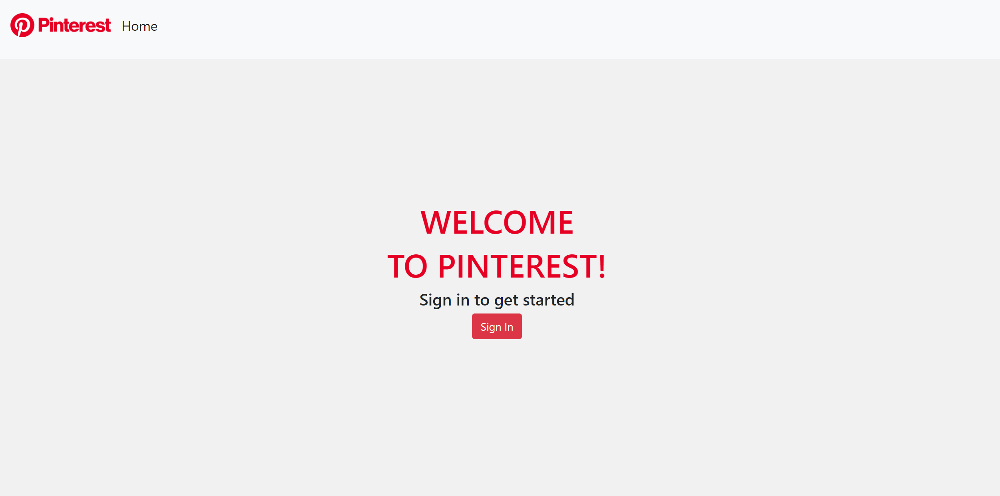
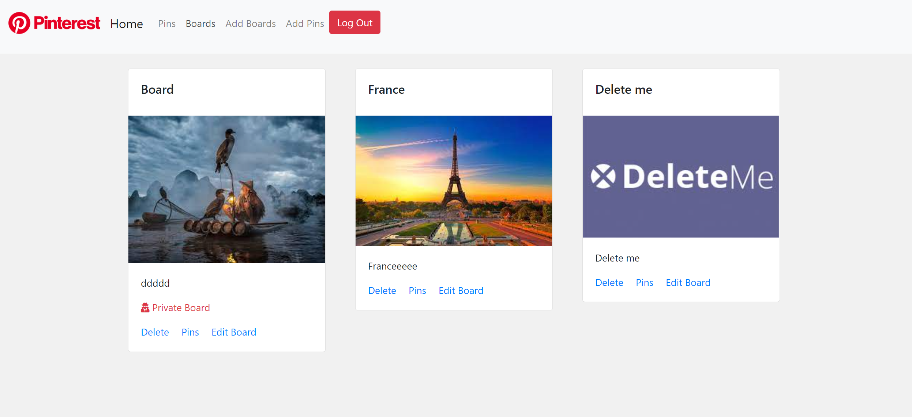

# Almost Pinterest - React 
The purpose of this project is to recreate Almost Pinterest using react. This is a full CRUD application that the user can authenticate and create/read/update/delete boards and pins.

[Link to app](https://almost-pinterest-react.netlify.app/)

## Features
1. The user can create new Board
2. The user can create new Pin and assign a specific Board
3. The user can read the existing data and see the boards and pins.
4. The user can update the boards and pins. (Also user can make private boards/pins)
5. The user can delete the board and associated pins with the board.

## Deployed Netlify App

## Screenshot of the Project

When the user is not authenticated
  

When the user is authenticated
  

## ERD
https://dbdiagram.io/d/6099c9e9b29a09603d14435c

## Wireframe
https://xd.adobe.com/view/712a0f65-47da-4016-aaac-15ec98d2b648-2479/?hints=off

## Contributors
@seancrossettie @Mitchell-Crumbley @robertncole1 @chiestroud
